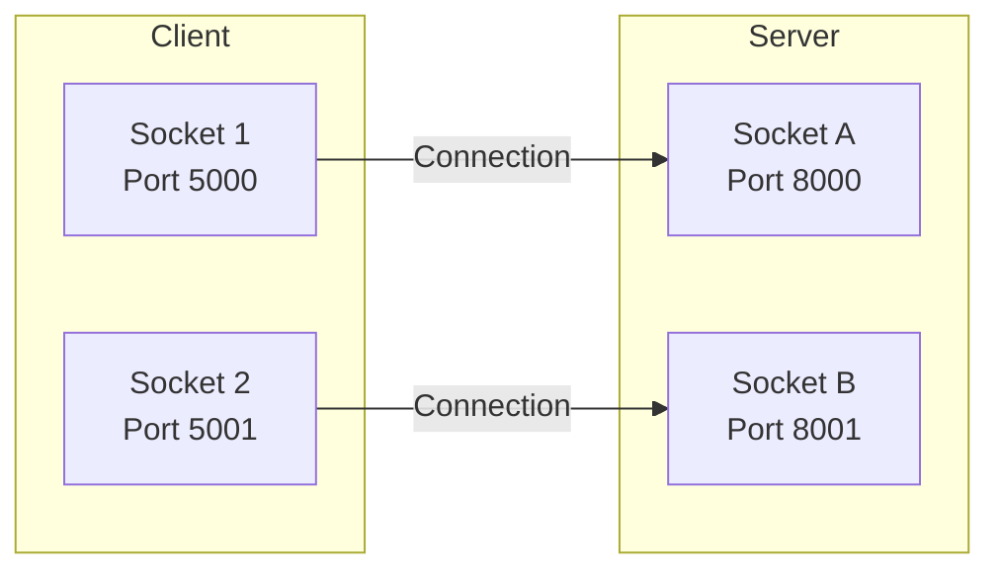

Welcome! Before our live session on socket programming, let's get familiar with the basics. This preparation should take about 45 minutes. We'll learn how programs on different computers talk to each other over a network.

## What is a Network Socket?

Imagine the internet is like a huge city connecting many buildings (computers). Each building has a unique street address, called an **IP address** (e.g., `192.168.1.10` or `8.8.8.8`). This address makes sure information gets sent to the right _computer_.

But what if that computer is running many different programs at once (like a web browser, a game, and email)? How does the information reach the _correct program_? That's where sockets and ports come in.

A **network socket** is like a specific communication endpoint for an application on a computer. Think of it as the program's personal doorway for sending and receiving network messages. To make this doorway unique, it uses the computer's IP address _plus_ a special number called a port.



## Ports: The Application's Doorbell

A **port number** is a number between 0 and 65535. If the IP address tells you which building (computer) to go to, the port number tells you which apartment or office (application) inside that building you need.

When data arrives at a computer (identified by its IP address), the operating system looks at the port number attached to that data. It then directs the data to the specific application that is "listening" on that port.

- **Well-Known Ports (0-1023):** These are usually reserved for common, standard services. For example, web servers often use port 80 (for HTTP) or 443 (for secure HTTPS). You usually don't need special permissions to connect _to_ these ports, but setting up a server _on_ these ports might require administrator rights.
- **Other Ports (1024-65535):** These are available for general use by other applications (like games, databases, or custom programs you write).

So, a socket is really the combination of an **IP address + Port number**. This pair uniquely identifies one side of a network communication link.

## The Client-Server Model

A very common way programs communicate over a network is the **client-server model**.

- **Server:** A program that runs on a computer, "listens" on a specific IP address and port number, and waits for other programs to contact it. It provides some kind of service (e.g., hosting a website, managing a game). Like a shop waiting for customers at its specific address and door number.
- **Client:** A program that _starts_ the conversation by connecting to a server. The client needs to know the server's IP address and the specific port number the server is listening on. Like a customer going to the shop's address and ringing the correct doorbell (port).

When you visit `google.com`, your browser (the client) connects to one of Google's computers (using its IP address) on port 443 (the standard port for secure websites). Google's web server (the server) is listening on that IP and port, receives the request, and sends the webpage data back to your browser.

## Sockets in Python

Python has a built-in `socket` library that lets us create clients and servers. Let's look at how to set up a simple server first, and then how a client connects to it.

### Python Server Example

This server listens on port `9999` for one connection, receives a message, and then stops.

### Try it yourself (Server)

1. In VS Code, create a new Python file (e.g., `server.py`).
2. Paste this code:

```python
import socket

print("Server: Starting...")
try:
    # Create a socket
    server_socket = socket.socket()
    print("Server: Socket created.")

    # Address to listen on ('0.0.0.0' means all available interfaces) and port
    server_address = ("0.0.0.0", 9999)

    print(f"Server: Binding to {server_address[0]}:{server_address[1]}...")
    # Attach the socket to the address and port
    server_socket.bind(server_address)

    # Start listening for incoming connections (allow 1 waiting connection)
    server_socket.listen(1)
    print(f"Server: Listening on port {server_address[1]}...")

    # Wait for a client to connect (this stops the program until connection)
    client_connection, client_address = server_socket.accept()
    print(f"Server: Connection accepted from {client_address[0]}:{client_address[1]}")

    # Receive data (up to 1024 bytes)
    data_received = client_connection.recv(1024)
    # Decode the bytes back into a string
    message = data_received.decode('utf-8')
    print(f"Server: Received: '{message}'")

    # Close the connection with the client
    client_connection.close()
    print("Server: Client connection closed.")

    # Close the server's listening socket
    server_socket.close()
    print("Server: Server socket closed.")

except socket.error as err:
    print(f"Server: Socket error: {err}")
except Exception as e:
    print(f"Server: An error occurred: {e}")
```

1. Save the file. You'll run this first.

### Python Client Example

This client tries to connect to a server running on the _same machine_ (`127.0.0.1`, also known as `localhost`) on port `9999`. It expects the server (from the example above) to be running.

### Try it yourself (Client)

1. Open VS Code.
2. Create another new Python file (e.g., `client.py`).
3. Paste this code:

```python
import socket

print("Client: Starting...")
try:
    # Create a socket
    client_socket = socket.socket()
    print("Client: Socket created.")

    # Server address (localhost means this computer) and port
    server_address = ("127.0.0.1", 9999)

    print(f"Client: Connecting to {server_address[0]}:{server_address[1]}...")
    # Connect to the server
    client_socket.connect(server_address)
    print("Client: Connected!")

    # Send a message (must be encoded to bytes)
    message = "Hi server!"
    client_socket.sendall(message.encode('utf-8'))
    print(f"Client: Sent: '{message}'")

    # Close the socket
    client_socket.close()
    print("Client: Socket closed.")

except socket.error as err:
    print(f"Client: Failed to connect or send. Is server running? Error: {err}")
except Exception as e:
    print(f"Client: An error occurred: {e}")
```

1. Save the file. You'll run this _after_ starting the server.

### Running the Client and Server

1. Open two separate terminals in VS Code.
2. In the first terminal, run the server: `python server.py`
    - It should print messages and stop at "Listening on port 9999...".
3. In the second terminal, run the client: `python client.py`
    - The client should print its messages, including "Connected!" and "Sent: 'Hi server!'".
    - The server should then print that it accepted a connection, received the message, and closed.
    - Both scripts should finish.

**What to Observe:**

- The server uses `bind()` to claim a port and `listen()` to wait for clients.
- `accept()` waits for a client and gives back a _new_ socket just for talking to that specific client.
- The client uses `connect()` to reach out to the server's IP and port.
- `sendall()` sends data (as bytes), `recv()` receives data (as bytes). We use `.encode('utf-8')` and `.decode('utf-8')` to convert between strings and bytes.
- Sockets should be `close()`d.
- Using `try...except` helps handle network errors gracefully.

## Summary

Sockets are communication endpoints defined by an **IP address** and a **port number**. They allow specific applications on networked computers to talk to each other. The **client-server model** is common: servers `bind` and `listen` on a port, while clients `connect` to them. Python's `socket` module provides the functions needed to build these network programs.

<aside> 📌

The slides for the live session can be viewed here: [https://gamma.app/docs/Networking-2-Sockets-lco1tb9z8litcyu?mode=doc](https://gamma.app/docs/Networking-2-Sockets-lco1tb9z8litcyu?mode=doc)

Try not to peek before class - spoilers inside!

</aside>