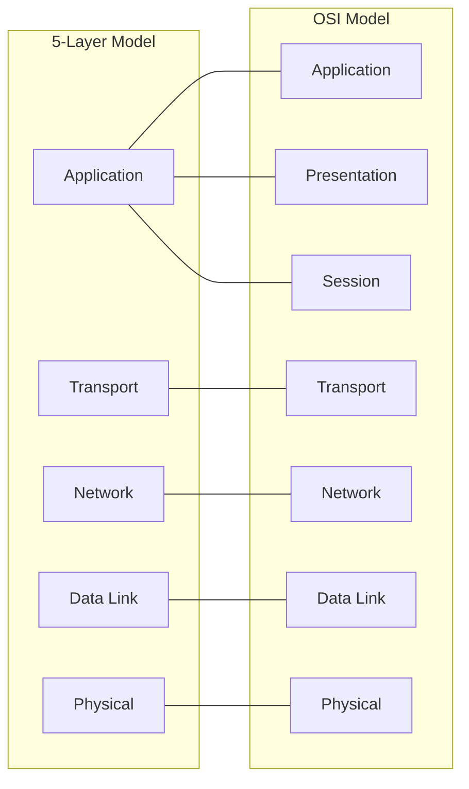

Welcome! Before our next session, let's explore how network communication is structured and introduce a powerful tool for observing it. This preparation should take about 45 minutes.

## The Need for Structure: Network Models

Why do we need models to describe computer networks? Sending data seems simple, like sending an email or loading a webpage. However, beneath the surface, countless complex interactions occur across different hardware and software components, potentially spanning the globe.

Without a standardized structure:

- **Complexity:** Managing the entire process from application click to data arriving across the world would be incredibly difficult. How would your browser know how to talk to a specific web server through potentially dozens of intermediate devices?
- **Interoperability:** How could a Mac computer reliably communicate with a Linux server if they didn't agree on common rules? Different vendors and technologies need a shared framework to ensure their products can work together.
- **Development & Innovation:** If every application developer had to reinvent the entire process of network transmission, innovation would slow dramatically. Models allow developers to focus on their specific layer (e.g., building a better web browser) without worrying about the underlying details of fiber optic transmission.
- **Troubleshooting:** When something goes wrong (e.g., a website won't load), a layered model helps isolate the problem. Is it an issue with the physical cable? The IP address? The application itself?

Network models, like blueprints for communication, solve these problems by dividing the complex task of networking into smaller, manageable **layers**. Each layer has specific responsibilities and interacts only with the layers directly above and below it. This modular approach brings order, promotes standardization, and simplifies both development and troubleshooting.

.png)

While several models exist, the two most referenced are:

- **OSI (Open Systems Interconnection) Model:** A 7-layer conceptual model published by the International Organization for Standardization (ISO). It's very detailed and excellent for understanding the theory of networking, but not always directly implemented in its full 7-layer form.
- **TCP/IP Model:** A more practical model that closely reflects the actual implementation of the internet protocols (TCP and IP). It's often described with 4 or 5 layers. We will focus on a common **5-Layer TCP/IP Model** as it provides a good balance of detail and practical relevance for cybersecurity work.

## The 5-Layer TCP/IP Model

This model provides a practical framework for understanding how data travels from an application on one computer to an application on another computer across a network. Let's use the analogy of sending a physical letter or package.

1. **Application Layer:**
    - **Purpose:** Provides the interface for software to use network services. This is where user-facing protocols operate.
    - **Analogy (Physical Mail):** This is like **writing the actual letter or preparing the contents of the package**. You decide _what_ information to send (the email message, the request for a webpage) and its purpose (personal letter, business order). The application formats this data.
    - **Examples:** HTTP/HTTPS (browsing), SMTP (email), DNS (address lookup).
    - **Data Unit:** Often simply called "Data" or "Message".
2. **Transport Layer:**
    - **Purpose:** Responsible for process-to-process communication (getting data to the _correct application_ on the destination host) and managing the quality of the connection (reliability, flow control).
    - **Analogy (Physical Mail):** This is like **choosing the shipping service and preparing the package for the specific recipient within the destination building**. You decide if you need tracking and delivery confirmation (like TCP, using registered mail) or if standard, faster, but less guaranteed delivery is okay (like UDP, using a standard postcard). You also specify the department or person (the port number) within the destination address, ensuring it reaches the correct end-point _inside_ the building (computer).
    - **Key Protocols:** TCP (Transmission Control Protocol), UDP (User Datagram Protocol).
    - **Data Unit:** Segment (TCP) or Datagram (UDP).
3. **Network Layer (or Internet Layer):**
    - **Purpose:** Responsible for logical addressing (IP addresses) and routing data packets across different networks (internetworking). It finds the best path from the source computer to the destination computer.
    - **Analogy (Physical Mail):** This is like **writing the full destination address (Street, City, Zip Code - like the IP address) and the return address on the envelope or package**. The postal service uses this global address to figure out the route across cities and countries to get the package to the correct destination city or town.
    - **Key Protocols:** IP (Internet Protocol), ICMP (Internet Control Message Protocol).
    - **Data Unit:** Packet.
4. **Data Link Layer:**
    - **Purpose:** Responsible for transferring data between devices on the _same_ local network segment (like your home Wi-Fi or an office Ethernet network). It uses physical addresses (MAC addresses) and manages access to the shared physical medium.
    - **Analogy (Physical Mail):** This is the **local mail carrier delivering the package on their specific route**. They use the specific house number (like the MAC address) to deliver the package to the correct physical building on _that street segment_ (local network). This layer handles the rules for accessing the local road (e.g., Ethernet or Wi-Fi rules).
    - **Key Protocols:** Ethernet, Wi-Fi (802.11), ARP (Address Resolution Protocol).
    - **Data Unit:** Frame.
5. **Physical Layer:**
    - **Purpose:** Responsible for the actual transmission and reception of raw bits (0s and 1s) over the physical medium (cables, radio waves). It defines the physical characteristics of the connection.
    - **Analogy (Physical Mail):** This represents the **physical infrastructure used for transport**: the actual roads, mail trucks, airplanes, mailbags, the paper of the letter, and the physical act of moving the mail from one point to the next.
    - **Examples:** Ethernet cables, Wi-Fi radio waves, fiber optic cables, connectors, voltage levels.
    - **Data Unit:** Bits.

### Encapsulation and Decapsulation

A crucial concept is **encapsulation**. Using our mail analogy: you write the letter (Application data), put it in a service envelope specifying the department/port (Transport header), put _that_ envelope into a larger one with the full street/city/zip address (Network header), and finally, the local mail carrier puts this into their mailbag marked for the specific house number on their route (Data Link header/trailer). Each step adds necessary information for that stage of the journey.

On the receiving end, **decapsulation** occurs. The local carrier delivers the mailbag (Data Link), the building's mailroom opens it and finds the envelope with the full address (Network), they route it internally based on the service envelope (Transport), and finally, the recipient opens the letter (Application). Each layer processes and removes its own information before passing the contents up.

### Think about it

How does the layered approach help in troubleshooting? If a letter never arrives, was the address wrong (Network Layer)? Did the local carrier lose it (Data Link Layer)? Was the road blocked (Physical Layer)? Or did you forget to put it in the mailbox (Application/Transport Layer)?

## Introduction to Wireshark

How can we actually _see_ this layered communication happening? We use a **network protocol analyzer**, commonly called a "packet sniffer". The most popular and powerful free tool for this is **Wireshark**.

Wireshark captures the network traffic arriving at or leaving your computer's network interface. It then decodes this traffic, displaying the details of each packet and sorting the information according to the protocol layers (like our 5-layer model). Think of it as having special glasses that let you see all the envelopes, addresses, and delivery instructions for every piece of data mail passing by.

This allows you to:

- See the headers added at each layer (Ethernet, IP, TCP/UDP, etc.).
- Analyze protocol behavior (e.g., watch the TCP handshake).
- Troubleshoot network problems ("Why can't I reach this website?").
- Learn how network protocols work in detail.
- Identify potentially malicious activity.

In cybersecurity, Wireshark is an indispensable tool for understanding network communications, analyzing malware traffic, investigating incidents, and testing network security.

### Try it yourself

Think about sending an email with a large attachment. Using the mail analogy, how does encapsulation work? Which layer might be responsible for breaking the large attachment data into smaller, numbered "packages" to ensure they all arrive and can be reassembled correctly? (Hint: Think about reliability).

## Setup: Installing Wireshark on macOS

Before our live session, please install Wireshark:

1. **Download:** Go to the official Wireshark download page: [https://www.wireshark.org/download.html](https://www.wireshark.org/download.html)
2. **Select Installer:** Find the macOS Arm .dmg installer
3. **Install:** Open the downloaded `.dmg` file. Drag the Wireshark icon into your Applications folder.
4. **Install ChmodBPF (Capture Permissions):** The `.dmg` file also contains a package named "Install ChmodBPF.pkg". Double-click this package and follow the installation prompts. This component is necessary for Wireshark to capture live network traffic without requiring you to run Wireshark as the root user (which is generally discouraged for security reasons). You will likely need to enter your administrator password during this installation.
5. **Allow System Extension (If Prompted):** macOS might ask for permission to allow the system extension related to ChmodBPF or Wireshark's capture components. Go to System Settings > Privacy & Security and allow it if prompted. You might need to restart your Mac after allowing the extension.
6. **Run Wireshark:** Launch Wireshark from your Applications folder. It might perform an initial setup or ask for permissions again on the first run.

You don't need to _use_ Wireshark extensively yet, just ensure it's installed and launches without errors. We will explore its interface together in the live session.

That's it for the pre-class preparation. Make sure you have Wireshark installed, and reflect on the purpose of the 5-layer model using the physical mail analogy. See you in the session!

<aside> 📌

The slides for the live session can be viewed here: [https://gamma.app/docs/Networking-3-5-Layer-Model-Wireshark-a3al2q5nt32ewgy?mode=doc](https://gamma.app/docs/Networking-3-5-Layer-Model-Wireshark-a3al2q5nt32ewgy?mode=doc)

Try not to peek before class - spoilers inside!

</aside>