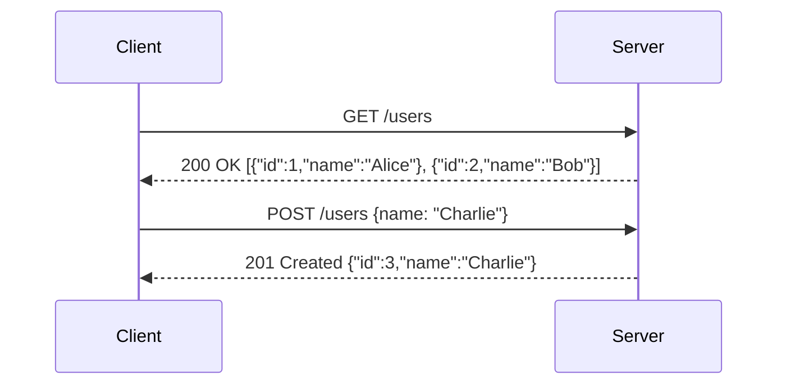

Welcome to the pre-class preparation for our upcoming session on APIs and Authentication! This material will provide you with the foundational knowledge needed to understand how different software systems communicate and how we ensure those communications are secure and authorized.

## What is an API?

API stands for **Application Programming Interface**. At its core, an API is a set of rules and protocols that allows one software application to interact with another. Think of it as a contract between two pieces of software: one offers services (the API provider), and the other consumes those services (the API client).

Imagine you're at a restaurant. You (the client) want food. The kitchen (the provider) can prepare it. You don't go into the kitchen yourself and start cooking. Instead, you interact with a waiter (the API). The waiter takes your order (a request), communicates it to the kitchen, and then brings your food back (a response). The menu acts as a guide to what you can order and what to expect – similar to how API documentation tells developers what services are available and how to use them.

In the context of web development, we often deal with **Web APIs**. These APIs are accessed over the web using the HTTP protocol. They allow different web services, mobile apps, or even other servers to communicate and exchange data. For example, when a weather app on your phone shows you the current temperature, it's likely fetching that data from a weather service's API. When you log in to a website using your Google account, that's also an API in action (Google's authentication API).



### Why are APIs important?

APIs are crucial for modern software development for several reasons:

- **Modularity:** APIs allow complex applications to be broken down into smaller, independent services. Each service can be developed, deployed, and scaled independently.
- **Reusability:** Once an API is created, its functionality can be reused by multiple applications. For instance, a payment processing API can be used by many different e-commerce websites.
- **Integration:** APIs enable different systems, built with different technologies, to connect and share data. This is vital for creating rich, interconnected experiences.
- **Abstraction:** APIs hide the underlying complexity of a system. A client application doesn't need to know how the provider's service is implemented; it only needs to know how to interact with the API.
- **Innovation:** By exposing data and functionality through APIs, companies can allow third-party developers to build new and innovative applications on top of their platforms.

### Common API Architectural Styles: REST

While there are several ways to design APIs, one of the most prevalent styles for web APIs is **REST (Representational State Transfer)**. REST is an architectural style, not a strict protocol, that uses standard HTTP methods to perform operations on resources.

Key principles of REST:

- **Resources:** Everything in a REST API is considered a "resource." A resource could be a user, a product, an order, or any other piece of information. Resources are identified by URLs (Uniform Resource Locators), like `https://api.example.com/users/123` or `https://api.example.com/products`.
- **HTTP Methods:** RESTful APIs use standard HTTP methods to perform actions on these resources:
    - `GET`: Retrieve a resource (e.g., get user details).
    - `POST`: Create a new resource (e.g., create a new user).
    - `PUT`: Update an existing resource entirely (e.g., update all details of a user).
    - `PATCH`: Partially update an existing resource (e.g., update only the email address of a user).
    - `DELETE`: Remove a resource (e.g., delete a user).
- **Statelessness:** Each request from a client to a server must contain all the information needed to understand and process the request. The server does not store any client context between requests. If state is needed (like a user's session), it's managed on the client side and sent with each relevant request.
- **Client-Server Architecture:** The client (which consumes the API) and the server (which provides the API) are separate. This separation allows them to evolve independently.
- **Uniform Interface:** REST APIs have a consistent way of interacting, regardless of the specific resource. This usually involves using standard HTTP methods, URIs to identify resources, and a standard media type (like JSON) for exchanging data.

### API Requests and Responses

When a client communicates with a web API, it sends an **HTTP request**, and the server replies with an **HTTP response**. You've encountered these in the HTTP lesson, but let's recap in the API context:

- **Request:**
    - **URL (Endpoint):** Specifies the resource the client wants to interact with (e.g., `/users`, `/products/789`).
    - **Method:** The HTTP verb (`GET`, `POST`, `PUT`, `DELETE`, etc.) indicating the desired action.
    - **Headers:** Additional information sent with the request, such as the content type of the data being sent (`Content-Type: application/json`), authentication information (`Authorization: Bearer <token>`), or caching directives.
    - **Body (Payload):** Data sent to the server, typically for `POST`, `PUT`, or `PATCH` requests. This is often in JSON format. `GET` and `DELETE` requests usually don't have a body.
- **Response:**
    - **Status Code:** A three-digit number indicating the outcome of the request (e.g., `200 OK`, `201 Created`, `400 Bad Request`, `401 Unauthorized`, `404 Not Found`, `500 Internal Server Error`).
    - **Headers:** Additional information sent with the response, such as the content type of the data being returned (`Content-Type: application/json`), caching information, or rate limiting details.
    - **Body (Payload):** The data returned by the server, often in JSON format. For example, a `GET` request to `/users/123` might return a JSON object with the user's details.

### Data Formats in APIs: JSON

APIs need a standard way to structure the data they exchange. While XML (eXtensible Markup Language) was historically common, **JSON (JavaScript Object Notation)** is now the de facto standard for most web APIs.

JSON is a lightweight, human-readable data interchange format. It's easy for humans to read and write, and easy for machines to parse and generate. It represents data as key-value pairs (like Python dictionaries) and ordered lists (like Python lists).

Example of JSON data representing a user:

```json
{
  "id": 123,
  "username": "cyber_student",
  "email": "student@example.com",
  "isActive": true,
  "roles": ["student", "editor"]
}
```

### Think about it

- Why do you think JSON has become more popular than XML for web APIs? Consider factors like readability, verbosity, and ease of use with JavaScript.

## Introduction to Authentication and Authorization

When an API exposes data or functionality, it's often crucial to control who can access it and what they can do. This is where authentication and authorization come in.

### What is Authentication?

**Authentication** is the process of verifying the identity of a user, application, or device. It answers the question: "Who are you?". Before an API grants access to its resources, it needs to be sure that the requester is who they claim to be.

Think of it like showing your ID card to a security guard before entering a building. The guard checks your ID to confirm you are a legitimate person allowed to request entry.

### Why is Authentication needed for APIs?

- **Protecting Sensitive Data:** APIs often handle personal, financial, or confidential information. Authentication ensures that only legitimate users can access this data.
- **Controlling Access to Functionality:** Some API operations (like creating or deleting data) should only be performed by authenticated and authorized users.
- **Tracking Usage:** Authentication allows API providers to track who is using their API, which can be important for billing, rate limiting (preventing abuse), and analytics.
- **Personalization:** Once a user is authenticated, the API can provide a personalized experience or data specific to that user.

### Common API Authentication Methods

There are various methods to authenticate requests to an API. Here are a few common ones:

1. **API Keys:**
    
    - **How it works:** The client is issued a unique string (the API key). The client includes this key in its requests (often in an HTTP header like `X-API-Key` or as a query parameter). The server validates the key to authenticate the request.
        
    - **Pros:** Simple to implement and use.
        
    - **Cons:** Keys are often long-lived. If a key is compromised, it can be used by an attacker until revoked. They don't inherently identify a specific _user_ but rather a specific _client application_.
        
        
        
2. **HTTP Basic Authentication:**
    
    - **How it works:** The client sends a username and password in the `Authorization` HTTP header. The value is the word "Basic" followed by a space and a base64-encoded string of `username:password`.
    - **Pros:** Simple, widely supported.
    - **Cons:** Sends credentials with every request. **Must** be used over HTTPS to prevent credentials from being intercepted as base64 is easily decoded. Not ideal for browser-based clients as it often triggers a native browser login popup.
3. **Bearer Tokens (e.g., OAuth 2.0, JWT):**
    
    - **How it works:** The client first obtains a token (the "bearer token") from an authentication server after successfully authenticating (e.g., with a username/password, or through a third-party provider like Google). The client then includes this token in the `Authorization` header of its API requests, prefixed with "Bearer ". Example: `Authorization: Bearer <your_token_here>`.
    - **OAuth 2.0** is an authorization framework that enables third-party applications to obtain limited access to an HTTP service, either on behalf of a resource owner or by allowing the third-party application to obtain access on its own behalf. It often involves tokens.
    - **JWT (JSON Web Token)** is a compact, URL-safe means of representing claims to be transferred between two parties. JWTs are often used as bearer tokens. They are digitally signed (and can be encrypted) and contain "claims" (pieces of information) about the user and the token itself (e.g., expiration time).
    - **Pros:** More secure than Basic Auth as credentials aren't sent with every request. Tokens can be short-lived and have specific scopes (permissions). JWTs are self-contained and can carry user information, reducing the need for database lookups on the server.
    - **Cons:** More complex to implement initially. Token management (storage, expiry, revocation) needs careful handling.
    
    
    

### Try it yourself

- Open your browser's developer tools (usually by pressing F12 or right-clicking and selecting "Inspect"). Go to the "Network" tab.
- Now, visit a website you log into (like a social media site or a news site with a login). Perform a login.
- Observe the network requests. Can you identify any requests that seem related to authentication? Look at their headers. Do you see an `Authorization` header? What kind of value does it have (if any)? _Don't share any sensitive details you find, just observe the pattern._

### What is Authorization?


**Authorization** comes _after_ authentication. Once a user's identity is confirmed (authentication), authorization determines what that user is allowed to do. It answers the question: "What are you allowed to do?".

For example, on a blogging platform:

- Any visitor (even unauthenticated) might be authorized to _read_ blog posts.
- An authenticated user (e.g., "Alice") might be authorized to _create_ new posts and _edit_ or _delete_ her own posts.
- An authenticated administrator (e.g., "AdminBob") might be authorized to _edit_ or _delete_ _any_ post on the platform.

Authentication confirms you are Alice. Authorization checks if Alice has permission to delete a specific post.

### Authentication vs. Authorization

|Feature|Authentication|Authorization|
|---|---|---|
|**Purpose**|Verifies identity (Who are you?)|Grants/denies permissions (What can you do?)|
|**Process**|Confirms credentials (e.g., password, token, key)|Checks access control rules against the identity|
|**Timing**|Happens first|Happens after successful authentication|
|**Outcome**|Identity is known or unknown|Access is granted or denied to a specific resource/action|
|**Analogy**|Showing your ID to enter a building|Checking your ticket type to see if you can enter the VIP area|

Understanding both concepts is vital for building secure APIs. An API might authenticate a user correctly but still be vulnerable if it doesn't properly authorize their actions.

This pre-class material should give you a solid starting point. In our live session, we'll dive deeper into these topics, explore practical examples, and discuss how to implement and secure APIs.

<aside> 📌

The slides for the live session can be viewed here: [https://gamma.app/docs/Web-5-API-Authentication-qqn0wpkd81o3c9p?mode=doc](https://gamma.app/docs/Web-5-API-Authentication-qqn0wpkd81o3c9p?mode=doc)

Try not to peek before class - spoilers inside!

</aside>