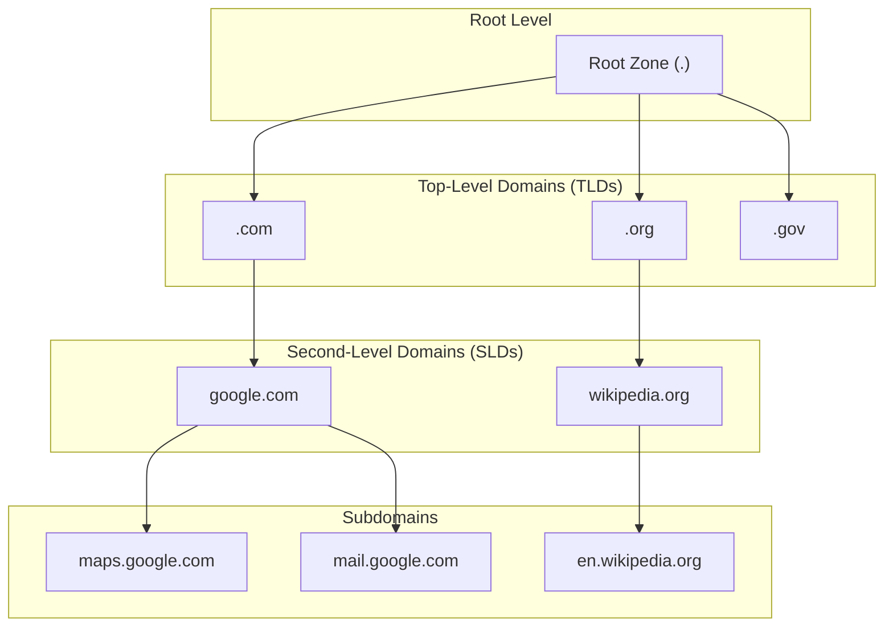

Welcome to the Domain Name System (DNS)! Before our live session, please go through this material to understand the basics of how we navigate the internet using names instead of numbers.

## What is DNS and Why Do We Need It?

Computers on the internet communicate using numerical addresses called IP addresses (like `142.250.180.142` or `2a00:1450:4005:80a::200e`). Imagine trying to remember the phone numbers of all your contacts – it would be impossible! Similarly, remembering IP addresses for every website you visit is impractical.

Humans prefer using memorable names, like `google.com` or `wikipedia.org`. The Domain Name System (DNS) acts like the internet's phonebook. Its primary job is to translate these human-friendly domain names into the computer-friendly IP addresses needed to locate and connect to servers.

Without DNS, navigating the web would involve typing long strings of numbers for every site, making the internet far less user-friendly.

## The DNS Hierarchy: A Global Directory

DNS isn't just one giant phonebook; it's a distributed, hierarchical system. Think of it like an upside-down tree:

1. **Root Zone (.)**: At the very top are the root servers. There isn't just one, but a network of hundreds of servers worldwide managed by various organizations. They don't know the IP address for `www.google.com` directly, but they know where to find the servers responsible for the next level down: the Top-Level Domains. You often don't see the final dot in web addresses, but it's implicitly there (e.g., `google.com.` is the fully qualified name).
2. **Top-Level Domains (TLDs)**: These are the familiar endings like `.com`, `.org`, `.net`, `.gov`, `.uk`, `.de`, etc. Each TLD has its own set of authoritative name servers that manage the domains directly under them. The root servers direct queries to the appropriate TLD servers. For example, if you ask for `google.com`, the root server says, "I don't know, but ask the `.com` servers."
3. **Second-Level Domains (SLDs)**: This is the part you usually register, like `google` in `google.com` or `wikipedia`in `wikipedia.org`. The organization that registers the domain (e.g., Google LLC, Wikimedia Foundation) manages its own authoritative name servers (or delegates this to their hosting provider). These servers hold the actual records that map names to IP addresses for that specific domain.
4. **Subdomains**: Organizations can further divide their domains using subdomains, like `mail.google.com` or `en.wikipedia.org`. The authoritative name servers for the main domain (`google.com`, `wikipedia.org`) also handle requests for their subdomains or delegate them to other specific name servers.

This hierarchical structure makes the system scalable and resilient. No single entity holds all the information, and responsibility is delegated down the tree.

## How Does a DNS Query Work?

When you type `www.example.com` into your browser, a multi-step process happens behind the scenes, often involving several types of DNS servers:

1. **Local Cache Check**: Your computer first checks its own DNS cache (a temporary memory of recent lookups) and your browser checks its cache. If the IP address for `www.example.com` was recently looked up and is still valid (based on its Time-To-Live or TTL value), the IP address is returned immediately, and the process stops here. Your operating system might also check a local `hosts` file first, which manually maps names to IPs.
2. **Recursive Resolver (Your ISP/Public DNS)**: If the address isn't in the local cache, your computer sends the query to its configured DNS resolver. This is usually provided by your Internet Service Provider (ISP), but you might configure it to use a public resolver like Google's (`8.8.8.8`) or Cloudflare's (`1.1.1.1`). This resolver acts on your behalf to find the answer. This type of query is called a **recursive query** because the client asks the resolver to perform the full lookup process and return the final answer.
3. **Root Server Query**: The recursive resolver, if it doesn't have the answer cached, starts by asking one of the root name servers: "Where can I find the IP for `www.example.com`?"
4. **TLD Server Query**: The root server doesn't know the final answer but knows who manages the `.com` TLD. It replies with the addresses of the `.com` TLD name servers. The resolver then asks a `.com` TLD server: "Where can I find the IP for `www.example.com`?"
5. **Authoritative Name Server Query**: The `.com` TLD server doesn't know the final answer but knows the authoritative name servers responsible for the `example.com` domain (these were specified when the domain was registered). It replies with the addresses of `example.com`'s authoritative name servers. The resolver then asks one of `example.com`'s authoritative name servers: "What is the IP address for `www.example.com`?"
6. **Final Answer**: The authoritative name server for `example.com` checks its records and finds the IP address associated with the `www` subdomain. It sends this IP address back to the recursive resolver. The queries performed by the resolver (steps 3-5) are called **iterative queries** because the resolver asks each server level for the next step until it gets the final answer.
7. **Caching and Response**: The recursive resolver receives the IP address, stores it in its cache for future requests (respecting the TTL), and finally sends the IP address back to your computer.
8. **Connection**: Your computer now has the IP address and can establish a connection to the web server hosting `www.example.com`.

This entire process usually happens in milliseconds!

### Think about it

- What are the potential benefits and drawbacks of using a public DNS resolver (like `1.1.1.1` or `8.8.8.8`) instead of the one provided by your ISP?

## Common DNS Record Types

Authoritative name servers store information in DNS records. While there are many types, here are some of the most common ones you'll encounter:

- **A Record (Address Mapping)**: Maps a hostname to an IPv4 address (e.g., `google.com` -> `142.250.180.142`). This is the most fundamental record type.
- **AAAA Record (IPv6 Address Mapping)**: Maps a hostname to an IPv6 address (e.g., `google.com` -> `2a00:1450:4005:80a::200e`). Pronounced "Quad-A".
- **CNAME Record (Canonical Name)**: Creates an alias, pointing one domain name to another (e.g., `www.example.com` might be a CNAME pointing to `example.com`). The DNS lookup will continue with the target name (`example.com`) to find its A or AAAA record. This is useful when multiple services run on the same IP address.
- **MX Record (Mail Exchanger)**: Specifies the mail servers responsible for receiving email for a domain. It includes a priority value, indicating the order in which servers should be tried (lower number = higher priority).
- **NS Record (Name Server)**: Delegates a domain or subdomain to a set of authoritative name servers. These records are what the TLD servers use to point resolvers to the domain's specific name servers.
- **TXT Record (Text)**: Allows administrators to store arbitrary text in a DNS record. Often used for verifying domain ownership (e.g., for Google Workspace or SSL certificates), email security policies (SPF, DKIM, DMARC), or other informational purposes.
- **PTR Record (Pointer)**: The reverse of A/AAAA records. Maps an IP address back to a hostname. Used in reverse DNS lookups, often for logging or verification purposes.

## DNS Caching and Time-To-Live (TTL)

To reduce the load on DNS servers and speed up lookups, DNS responses are cached at various levels: in your browser, your operating system, and recursive resolvers.

Each DNS record comes with a **Time-To-Live (TTL)** value, specified in seconds. This tells caches how long they are allowed to store and reuse that specific record before they must ask the authoritative server again.

- **Short TTL (e.g., 60-300 seconds)**: Changes propagate quickly, but it increases the load on authoritative servers as caches expire faster. Useful for records that might change frequently or during migrations.
- **Long TTL (e.g., 86400 seconds = 24 hours)**: Reduces server load and can speed up lookups for frequently accessed names, but changes take longer to propagate across the internet as caches hold onto old data longer.

Choosing appropriate TTL values involves balancing performance, server load, and the speed at which changes need to take effect.

### Try it yourself

1. Open the Terminal application on your Mac (you can find it using Spotlight search: Cmd + Space, then type "Terminal").
2. Type the command `ping -c 1 google.com` and press Enter. Look at the output. You should see an IP address in parentheses next to the domain name. This IP address was likely obtained via a DNS lookup.
3. Type `ping -c 1 heise.de` and press Enter. Note the different IP address.
4. Now, try `ping -c 1 non-existent-domain-12345.com`. What happens? You should see an error indicating the host could not be resolved, meaning DNS failed to find an IP address for that name.

This simple exercise demonstrates DNS in action, translating names you type into the IP addresses `ping` needs to send its request.

<aside> 📌

The slides for the live session can be viewed here: [https://gamma.app/docs/Networking-7-DNS-v2bxgw4bj9yff9x?mode=doc](https://gamma.app/docs/Networking-7-DNS-v2bxgw4bj9yff9x?mode=doc)

Try not to peek before class - spoilers inside!

</aside>