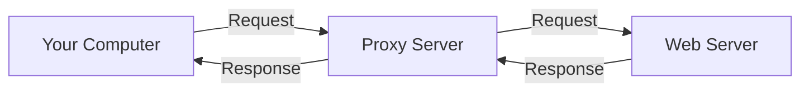

Welcome! Before our live session on Proxies, please go through this material. It covers the fundamental concepts you'll need.

## What is a Proxy Server?

Imagine you want to send a letter to someone, but you don't want them to know your home address, or perhaps you want the letter checked for anything suspicious before it reaches the recipient. You could give the letter to a trusted intermediary (like a mail forwarding service) who then sends it on your behalf.

In the digital world, a **proxy server** acts as that intermediary for network requests. When your computer (the **client**) wants to access a resource on the internet (like a website on a **server**), instead of connecting directly, it sends the request to the proxy server. The proxy server then forwards that request to the destination server, receives the response, and sends it back to your computer.

Think of it as a gateway or a middleman between your device and the internet.

## Why Use Proxies?

Proxies serve many purposes, often overlapping:

1. **Security:** Proxies can act as a firewall, filtering malicious traffic or blocking access to known harmful websites before they reach your network or device. They can hide your internal network structure from the outside world.
2. **Content Filtering:** Organizations (schools, companies) use proxies to block access to specific websites or types of content (e.g., social media, inappropriate sites) based on predefined policies.
3. **Caching:** Proxies can store (cache) copies of frequently accessed web pages or files. When another user requests the same resource, the proxy can deliver it from its cache instead of fetching it again from the internet, saving bandwidth and speeding up access.
4. **Anonymity & Privacy:** By forwarding your requests, a proxy can hide your original IP address from the destination server, making it harder to track your online activity back to you. However, the level of anonymity varies greatly depending on the proxy type.
5. **Bypassing Geo-Restrictions:** Some online content is restricted based on your geographical location (determined by your IP address). A proxy server located in a different region can make it appear as though your request is originating from that region, potentially granting you access.
6. **Load Balancing:** In large networks, multiple servers might host the same application. A reverse proxy (see below) can distribute incoming client requests evenly across these servers, preventing any single server from becoming overloaded.

### Think about it

Can you think of a situation where _you_ might have interacted with a proxy server without realizing it? (Hint: Consider your workplace or school network).

## Types of Proxies

Proxies come in various flavors, categorized by their function and level of anonymity.

### Forward Proxy

This is the most common type people refer to when just saying "proxy." It sits in front of _multiple clients_ (e.g., computers on a company network) and forwards their requests to various servers on the internet. It acts on behalf of the clients.

- **Use Cases:** Caching, content filtering, security for an internal network.

### Reverse Proxy

This proxy sits in front of _one or more servers_ and handles requests from multiple clients on the internet. It acts on behalf of the server(s). Clients connect to the reverse proxy, thinking it's the actual server.

- **Use Cases:** Load balancing, SSL encryption/decryption (offloading work from web servers), security (protecting servers from direct exposure), caching static content.

### Transparent Proxy

This type of proxy intercepts network traffic without requiring any configuration on the client's computer. Users might not even know they are using one. It often operates at the network gateway level.

- **Use Cases:** Often used by ISPs or large organizations for mandatory filtering or caching.

### Anonymity Levels

Proxies are also classified by how they handle the client's IP address information in the request headers sent to the destination server:

1. **High Anonymity (Elite) Proxy:** Does not identify itself as a proxy and does not reveal the original client IP address. Provides the highest level of anonymity.
2. **Anonymous Proxy:** Identifies itself as a proxy but does not reveal the original client IP address. The destination server knows a proxy is being used, but not who the original client is.
3. **Distorting Proxy:** Identifies itself as a proxy and passes a _false_ original client IP address.
4. **Transparent Proxy (Non-Anonymous):** Identifies itself as a proxy and _does_ reveal the original client IP address (often via specific HTTP headers like `X-Forwarded-For`). Offers no anonymity.

### Protocol-Specific Proxies

1. **HTTP/HTTPS Proxy:** Understands and handles web traffic (HTTP and HTTPS protocols). Most common for web browsing. HTTPS proxies can handle encrypted traffic, often through a method called tunneling (CONNECT method).
2. **SOCKS Proxy (e.g., SOCKS4, SOCKS5):** A lower-level proxy that can handle various types of traffic (HTTP, FTP, SMTP, torrents, etc.), not just web traffic. SOCKS5 adds authentication capabilities. Often used for applications that need more versatile proxy support beyond simple web browsing.

## Potential Drawbacks

- **Performance:** Adding an extra hop can sometimes slow down connections, especially if the proxy server is slow or overloaded.
- **Single Point of Failure:** If the proxy server goes down, users behind it might lose internet access (unless redundancy is built-in).
- **Security Risks (Untrusted Proxies):** Using free or untrusted public proxies can be dangerous. The proxy operator could potentially monitor your traffic, steal sensitive information (like passwords if traffic isn't encrypted end-to-end), or inject malware.
- **Complexity:** Setting up and managing proxies, especially complex configurations like reverse proxies with load balancing, requires expertise.

### Try it yourself

1. Open your computer's network settings (System Settings on macOS).
2. Look for "Proxies" or "Network Proxy" settings.
3. Observe the different types of proxies you can configure (e.g., Web Proxy (HTTP), Secure Web Proxy (HTTPS), SOCKS Proxy). You don't need to change anything, just explore the interface.

## Summary

Proxies are versatile intermediaries in network communication. They sit between clients and servers, forwarding requests and responses for various reasons, including security enhancement, content filtering, performance improvement via caching, enforcing access policies, achieving anonymity, and bypassing geographical restrictions. Understanding the difference between forward and reverse proxies, as well as the implications of different anonymity levels and protocols (HTTP vs. SOCKS), is crucial in networking and cybersecurity.

That's it for the pre-class reading! Make sure you've understood the core concepts, especially the purpose of proxies and the difference between forward and reverse proxies.

<aside> 📌

The slides for the live session can be viewed here: [https://gamma.app/docs/Networking-8-Proxies-rq7dhz1f9t6y6md?mode=doc](https://gamma.app/docs/Networking-8-Proxies-rq7dhz1f9t6y6md?mode=doc)

Try not to peek before class - spoilers inside!

</aside>