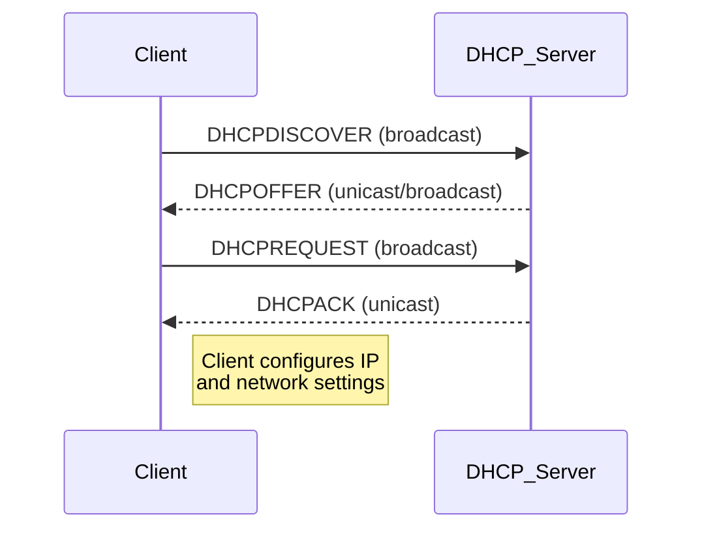

Willkommen zu Ihrer Vorbereitung auf unsere kommende Lektion über das Dynamic Host Configuration Protocol (DHCP). Ziel dieses Materials ist es, Sie mit den grundlegenden Konzepten von DHCP vertraut zu machen und zu erklären, warum es in modernen Netzwerken unerlässlich ist und wie es im Allgemeinen funktioniert. Bitte lesen Sie sich die Informationen sorgfältig durch.

## Was ist DHCP?

Stellen Sie sich vor, Sie betreten eine große Bibliothek, und statt eines Systems, das Ihnen einen Platz zuweist, sucht sich jeder einen aus. Ein Chaos, nicht wahr? Zwei Personen könnten versuchen, auf demselben Stuhl zu sitzen, oder einige Abteilungen sind überfüllt, während andere leer sind. In der Welt der Computernetzwerke benötigt jedes Gerät einen eindeutigen "Sitzplatz" oder, genauer gesagt, eine Adresse, um zu kommunizieren. Diese Adresse ist als **IP-Adresse** bekannt.

Das **Dynamic Host Configuration Protocol (DHCP)** ist so etwas wie der freundliche Bibliothekar für Netzwerke. Es ist ein Netzwerkverwaltungsprotokoll, das in IP-Netzwerken verwendet wird, wobei ein DHCP-Server jedem Gerät in einem Netzwerk automatisch eine IP-Adresse und andere Netzwerkkonfigurationsparameter zuweist, damit es mit anderen IP-Netzwerken kommunizieren kann. Ohne DHCP müssten Netzwerkadministratoren jedes Gerät, das dem Netzwerk beitritt, manuell konfigurieren - eine mühsame und fehleranfällige Aufgabe, insbesondere in großen Umgebungen.

![[Pasted image 20250929211058.png]]

**Gründe, warum DHCP so wichtig ist:**

- **Automatisierung:** Die manuelle Konfiguration von IP-Adressen für jedes Gerät wird überflüssig.
- **Genauigkeit:** Verringert das Risiko menschlicher Fehler, wie z. B. die Zuweisung derselben IP-Adresse an zwei verschiedene Geräte (IP-Konflikt) oder die Eingabe falscher Subnetzmasken oder Gateway-Adressen.
- **Effizienz:** IP-Adressen werden für einen bestimmten Zeitraum "geleast" und können zur Wiederverwendung in einen Pool zurückgegeben werden, wenn ein Gerät das Netz verlässt. Dies ist besonders nützlich für Netzwerke mit vielen flüchtigen Geräten, wie z. B. ein öffentlicher Wi-Fi-Hotspot.
- **Zentrales Management:** Netzwerkparameter wie DNS-Serveradressen und Standard-Gateway-Adressen können von einem zentralen Punkt aus verwaltet und verteilt werden.

## Überblick über die wichtigsten Netzwerk-Konzepte

Bevor wir uns näher mit DHCP beschäftigen, sollten wir einige grundlegende Netzwerkkonzepte wiederholen:

- **IP-Adresse (Internet-Protokoll-Adresse):** Eine eindeutige numerische Kennzeichnung, die jedem Gerät zugewiesen wird, das an ein Computernetzwerk angeschlossen ist, das das Internet-Protokoll zur Kommunikation verwendet. Stellen Sie sich das vor wie eine bestimmte Straßenadresse für ein Haus im Internet. Zum Beispiel "192.168.1.100".
- **Subnetzmaske:** Wird verwendet, um eine IP-Adresse in zwei Teile zu unterteilen: ein Teil identifiziert das Netzwerk (Netzwerkadresse), der andere Teil identifiziert das spezifische Gerät in diesem Netzwerk (Hostadresse). Zum Beispiel "255.255.255.0". Sie hilft den Geräten festzustellen, ob sich eine andere IP-Adresse im selben lokalen Netz oder in einem entfernten Netz befindet.
- **Standard-Gateway:** Ein Router in einem Netzwerk, der als Zugangspunkt zu anderen Netzwerken dient. Wenn Ihr Computer Informationen an ein Gerät senden möchte, das sich nicht in seinem lokalen Netzwerk befindet (z. B. eine Website im Internet), sendet er den Datenverkehr an das Standard-Gateway. Das Gateway leitet den Datenverkehr dann an sein Ziel weiter.
- **DNS-Server (Domain Name System Server):** Übersetzt von Menschen lesbare Domänennamen (wie `www.google.com`) in maschinenlesbare IP-Adressen (wie `172.217.160.142`). Computer verwenden IP-Adressen zur Kommunikation, aber Menschen können sich Namen leichter merken.

### Versuchen Sie es selbst: Prüfen Sie die Netzwerkkonfiguration Ihres Macs

Sie können diese Einstellungen auf Ihrem eigenen Mac sehen:

1. Öffnen Sie **Systemeinstellungen**.
2. Klicken Sie in der Seitenleiste auf **Netzwerk**.
3. Wählen Sie Ihre aktive Netzwerkverbindung aus (z. B. Wi-Fi oder Ethernet).
4. Klicken Sie auf die Schaltfläche **Details...** neben Ihrer aktiven Verbindung.
5. In dem daraufhin angezeigten Fenster sehen Sie Ihre IP-Adresse, die Subnetzmaske, den Router (Standard-Gateway) und die DNS-Server (unter der Registerkarte DNS).

Achten Sie darauf, ob dort "IPv4 konfigurieren: DHCP verwenden" steht. Das bedeutet, dass Ihr Mac als DHCP-Client fungiert!

## How DHCP Works: The DORA Process

![[Pasted image 20250929211108.png]]

Der Prozess, durch den ein Gerät Netzwerkkonfigurationsinformationen von einem DHCP-Server erhält, wird oft mit dem Akronym **DORA** bezeichnet, das für Discover, Offer, Request und Acknowledge steht. Dies ist ein vierstufiger Handshake zwischen dem DHCP-Client (Ihrem Gerät) und dem DHCP-Server.

1. **Erkennen (DHCPDISCOVER):**
    - Wenn ein DHCP-Client-Gerät hochfährt oder eine Verbindung zu einem Netzwerk herstellt und so konfiguriert ist, dass es automatisch eine IP-Adresse erhält, hat es keine IP-Informationen.
    - Es sendet eine "DHCPDISCOVER"-Nachricht in das lokale Netz. Diese Nachricht ist so, als würde der Client rufen: "Gibt es da draußen einen DHCP-Server, der mir eine IP-Adresse geben kann?"
    - Da der Client noch keine IP-Adresse hat, verwendet er `0.0.0.0` als seine Quell-IP-Adresse und `255.255.255.255` als Ziel-IP-Adresse (Broadcast-Adresse).
2. **Angebot (DHCPOFFER):**
    - Alle DHCP-Server im lokalen Netz, die die Nachricht "DHCPDISCOVER" empfangen und über verfügbare IP-Adressen verfügen, können darauf antworten.
    - Jeder interessierte DHCP-Server antwortet mit einer "DHCPOFFER"-Nachricht. Diese Nachricht wird per Unicast an den Client zurückgesendet (wenn möglich, unter Verwendung der MAC-Adresse des Clients) oder per Broadcast.
    - Das Angebot enthält eine vorgeschlagene IP-Adresse, die Subnetzmaske, das Standard-Gateway, den/die DNS-Server und die **Leasedauer** (die Zeitspanne, in der der Client diese IP-Adresse nutzen kann).
    - Es ist möglich, dass ein Client Angebote von mehreren DHCP-Servern erhält.
3. **Anfrage (DHCPREQUEST):**
    - Der Client prüft das/die Angebot(e). Normalerweise nimmt er das erste Angebot an, das er erhält.
    - Der Client sendet dann eine "DHCPREQUEST"-Nachricht an das Netz zurück. Diese Nachricht besagt im Wesentlichen: "Ich möchte die IP-Adresse [angebotene IP] von Server [Server-IP] annehmen".
    - Durch das Senden dieser Nachricht wird der ausgewählte Server darüber informiert, dass sein Angebot angenommen wurde, und auch alle anderen DHCP-Server, die Angebote gemacht haben, werden darüber informiert, dass ihre Angebote abgelehnt wurden. Dadurch wird verhindert, dass andere Server eine IP-Adresse reservieren, die nicht genutzt wird.
4. **Bestätigung (DHCPACK) / Negative Bestätigung (DHCPNAK):**
    - Der DHCP-Server, dessen Angebot angenommen wurde, schließt den Mietvertrag ab.
    - Er sendet eine "DHCPACK"-Nachricht (Acknowledge) an den Client. Diese Nachricht bestätigt alle Konfigurationsparameter, einschließlich der IP-Adresse, der Subnetzmaske, des Standard-Gateways, der DNS-Server und der Leasingdauer.
    - Nun kann der Client seine Netzwerkschnittstelle mit der angegebenen IP-Adresse konfigurieren und die Kommunikation im Netzwerk aufnehmen.
    - Wenn die angebotene IP-Adresse aus irgendeinem Grund nicht mehr verfügbar ist oder der Server die Anfrage nicht erfüllen kann, sendet der Server möglicherweise eine "DHCPNAK"-Nachricht (Negative Acknowledge). In diesem Fall müsste der Client den DORA-Prozess neu starten.

Dieser DORA-Prozess läuft sehr schnell ab, in der Regel innerhalb weniger Sekunden, jedes Mal, wenn ein Gerät eine Verbindung zu einem DHCP-fähigen Netz herstellt.

### Thinkommen: Ablauf und Erneuerung von Leases

Die von einem DHCP-Server zugewiesene IP-Adresse ist nicht dauerhaft, sondern wird für eine bestimmte Dauer "geleast".

- Warum, glauben Sie, sind Leases nicht dauerhaft?
- Was passiert Ihrer Meinung nach, wenn ein IP-Leasing abläuft? (Hinweis: Der Client hört nicht einfach auf zu arbeiten. Er versucht, den Lease zu erneuern, in der Regel, wenn 50 % der Lease-Zeit verstrichen sind, indem er eine "DHCPREQUEST" direkt an den Server sendet, der den Lease gewährt hat).

## Wichtige von DHCP bereitgestellte Informationen

Ein DHCP-Server kann einen Client mit einer Reihe von Konfigurationsparametern versorgen. Zu den häufigsten gehören:

- **IP-Adresse:** Eine eindeutige Adresse für den Client im Netz.
- **Subnetzmaske:** Definiert die Netzwerk- und Host-Anteile der IP-Adresse.
- **Standard-Gateway (Router)-Adresse:** Die IP-Adresse des Routers, den der Client verwenden soll, um externe Netzwerke zu erreichen.
- **DNS-Server-Adresse(n):** IP-Adresse(n) der DNS-Server für die Auflösung von Domänennamen.
- **Leasingdauer:** Der Zeitraum, für den die IP-Adresse gültig ist.
- **Domänenname:** Der Domänenname, den der Client verwenden soll.
- Andere Optionen: Wie z. B. NTP-Server (für die Zeitsynchronisation), TFTP-Server (für das Booten im Netzwerk) und weitere (definiert in den DHCP-Optionen).

## DHCP-Server- und Client-Rollen

- **DHCP-Server:** Dies ist ein speziell konfigurierter Netzwerkserver (oder ein Gerät wie ein Router mit DHCP-Server-Funktionalität), der einen Pool von IP-Adressen verwaltet und sie an Client-Geräte vermietet. Er lauscht auf "DHCPDISCOVER"-Nachrichten von Clients und antwortet gemäß dem DORA-Prozess.
- **DHCP-Client:** Jedes netzwerkfähige Gerät (z. B. Computer, Smartphone, Drucker, Smart-TV), das so konfiguriert ist, dass es seine IP-Adresse und Netzwerkeinstellungen automatisch von einem DHCP-Server bezieht. Die meisten Betriebssysteme haben einen integrierten DHCP-Client.

### Denken Sie darüber nach: Kein DHCP-Server?

Was passiert, wenn ein Gerät für die Verwendung von DHCP konfiguriert ist, es aber keinen DHCP-Server im Netzwerk gibt oder der Server ausgefallen ist?

- Das Gerät ist nicht in der Lage, über den DORA-Prozess eine IP-Adresse zu erhalten.
- Viele Betriebssysteme greifen dann auf **Automatic Private IP Addressing (APIPA)** oder **Link-Local Addressing** zurück. Das Gerät weist sich selbst eine IP-Adresse aus einem speziellen reservierten Bereich zu (z. B. "169.254.x.x" für IPv4).
- Geräte, die APIPA verwenden, können mit anderen APIPA-Geräten im selben lokalen Netzwerksegment kommunizieren, aber sie können nicht mit Geräten in anderen Netzwerken oder im Internet kommunizieren, da sie kein Standard-Gateway oder gültige DNS-Informationen haben. Möglicherweise wird eine Fehlermeldung wie "Eingeschränkte Konnektivität" oder "Selbst zugewiesene IP" angezeigt.

## Benefits of Using DHCP

Einige davon haben wir bereits angesprochen, aber fassen wir die wichtigsten Vorteile noch einmal zusammen:

- **Vereinfachte Administration:** Verringert den manuellen Aufwand und die technischen Kenntnisse, die für den Anschluss von Geräten an ein Netzwerk erforderlich sind, erheblich.
- **Reduzierte IP-Konflikte:** Verhindert die versehentliche Zuweisung der gleichen IP-Adresse an mehrere Geräte.
- **Effizientes IP-Adressmanagement:** IP-Adressen werden dynamisch zugewiesen und zurückverlangt, was eine effiziente Nutzung eines begrenzten IP-Adresspools gewährleistet.
- **Zentrale Konfiguration:** Ermöglicht Administratoren die Verwaltung und Aktualisierung von Netzwerkparametern (wie DNS-Servern oder Gateway-Adressen) von einem einzigen Standort aus. Die Änderungen werden automatisch an die Clients weitergegeben, wenn diese ihre Mietverträge erneuern.
- **Mobilität und Skalierbarkeit:** Einfache Anpassung an Geräte, die zwischen Netzwerken wechseln, oder an eine große Anzahl von Geräten, die dem Netzwerk beitreten oder es verlassen (z. B. Gast-Wi-Fi).

Dies ist der Abschluss Ihrer Vorbereitung auf den DHCP-Kurs. Wenn Sie diese Konzepte verstehen, können Sie den größten Nutzen aus unserer interaktiven Sitzung ziehen. Notieren Sie sich alle Fragen, die Sie haben!

<aside> 📌

The slides for the live session can be viewed here: [https://gamma.app/docs/DHCP-z9f2835wcka1te7?mode=doc](https://gamma.app/docs/DHCP-z9f2835wcka1te7?mode=doc)

Try not to peek before class - spoilers inside!

</aside>