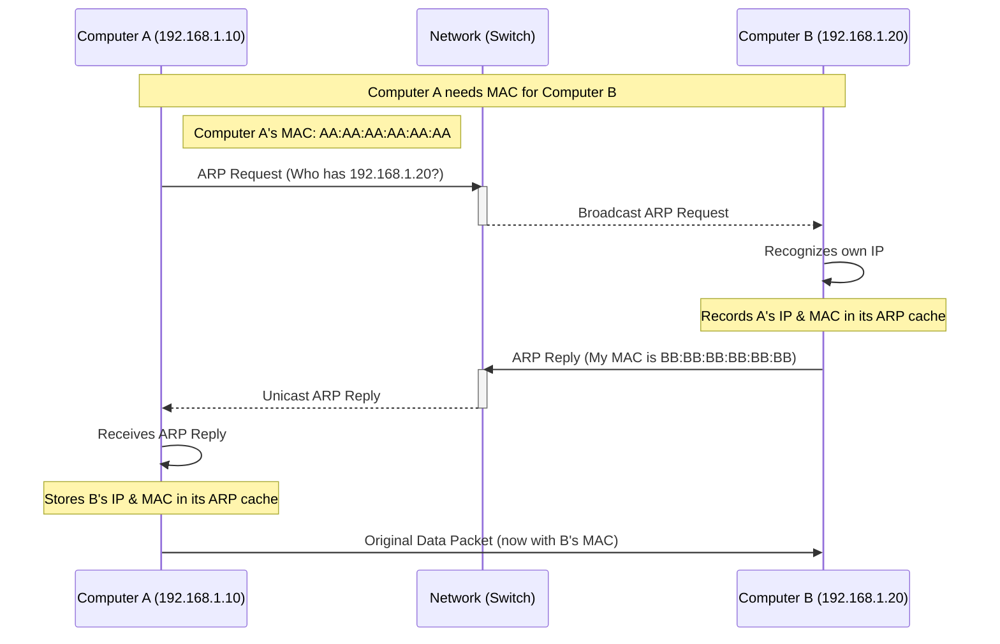

Welcome! Before our live session on the Address Resolution Protocol (ARP), please go through this material. It covers the essential concepts you'll need.

## The Problem: Addressing on the Local Network

When your computer wants to send data (an IP packet) to another device, it typically knows the destination **IP address**(e.g., `192.168.1.20`). This is a Layer 3 (Network Layer) address, used for routing across different networks.

However, for the final step of delivering data _within the same local network segment_ (like your home Wi-Fi or an office Ethernet network), the underlying Layer 2 (Datalink Layer) technology, usually Ethernet, doesn't use IP addresses. Instead, Ethernet uses physical **MAC addresses** (e.g., `BB:BB:BB:BB:BB:BB`) burned into the network interface cards (NICs) of devices. An Ethernet frame, which carries the IP packet locally, must be addressed to the destination device's specific MAC address.

So, the crucial question arises: **If Computer A (IP `192.168.1.10`) wants to send an IP packet to Computer B (IP `192.168.1.20`) on the _same local network_, how does Computer A find out the correct MAC address for Computer B to address the Ethernet frame properly?**

This is the exact problem the Address Resolution Protocol (ARP) solves.

_(Important Note: If the destination IP address were on a different network, the process is different. The sending computer wouldn't need the final destination's MAC address directly. Instead, it would need the MAC address of its default gateway (the local router). It would use ARP to find the router's MAC address and send the Ethernet frame containing the IP packet to the router, which would then forward the packet towards the remote network.)_

## What is ARP?

![[Pasted image 20250930061455.png]]

ARP stands for **Address Resolution Protocol**. Its primary job is to map Layer 3 (Network Layer) addresses, specifically IPv4 addresses, to Layer 2 (Datalink Layer) addresses, typically MAC addresses, for devices sharing the same local network segment (broadcast domain).

Think of it as a dynamic lookup service specifically for translating IP addresses to MAC addresses within your local network.

Key points about ARP:

- **Layer:** Operates at the boundary between Layer 2 (Datalink) and Layer 3 (Network). While it uses Layer 2 frames for transport, its purpose is to resolve Layer 3 addresses.
- **Scope:** ARP messages are confined to the local network segment. They are **not** routed across different networks by routers.
- **Stateless:** ARP itself doesn't maintain a persistent connection state. It's a simple request-response protocol.

## How ARP Works



Let's say Computer A (IP: 192.168.1.10, MAC: AA:AA:AA:AA:AA:AA) wants to send data to Computer B (IP: 192.168.1.20) on the same local network, but Computer A doesn't know Computer B's MAC address yet.

1. **Check the ARP Cache:** Computer A first checks its internal ARP cache (or ARP table). This is a temporary storage of recently learned IP-to-MAC address mappings. If Computer B's IP address (192.168.1.20) is already in the cache with a corresponding MAC address, ARP isn't needed for this particular transmission. The MAC address is retrieved from the cache, and the Ethernet frame is sent directly.
2. **Send ARP Request (Broadcast):** If 192.168.1.20 is _not_ in Computer A's ARP cache, Computer A constructs an **ARP Request** message. This message essentially asks: "Who has the IP address 192.168.1.20? Please tell 192.168.1.10 (which is me, Computer A, at MAC address AA:AA:AA:AA:AA:AA)."
    - This ARP Request is placed inside an Ethernet frame.
    - The source MAC address in the frame is Computer A's MAC (AA:AA:AA:AA:AA:AA).
    - The destination MAC address in the frame is the special **broadcast MAC address** (FF:FF:FF:FF:FF:FF).
    - Using the broadcast address ensures that every device on the local network segment receives and processes the ARP Request. Switches will flood this broadcast frame out all ports except the one it arrived on.
3. **Process ARP Request:** Every device on the local network receives the broadcast ARP Request.
    - Devices that are _not_ 192.168.1.20 will see that the target IP address doesn't match their own, and they will silently discard the request.
    - Computer B (192.168.1.20) recognizes its own IP address in the request. It now knows that Computer A (192.168.1.10 at AA:AA:AA:AA:AA:AA) is looking for its MAC address. Computer B also records Computer A's IP and MAC address mapping in its _own_ ARP cache (since Computer A kindly included its details in the request).
4. **Send ARP Reply (Unicast):** Computer B constructs an **ARP Reply** message. This message essentially says: "I have the IP address 192.168.1.20, and my MAC address is BB:BB:BB:BB:BB:BB."
    - This ARP Reply is placed inside an Ethernet frame.
    - The source MAC address in the frame is Computer B's MAC (BB:BB:BB:BB:BB:BB).
    - The destination MAC address in the frame is Computer A's MAC (AA:AA:AA:AA:AA:AA), which Computer B learned from the ARP Request.
    - Because the reply is sent to a specific MAC address (unicast), only Computer A will fully process it. Other devices and the switch will handle it like any other unicast frame.
5. **Update ARP Cache and Send Data:** Computer A receives the ARP Reply. It extracts Computer B's IP address (192.168.1.20) and MAC address (BB:BB:BB:BB:BB:BB) and stores this mapping in its ARP cache. Now that Computer A knows Computer B's MAC address, it can finally encapsulate its original IP packet into an Ethernet frame addressed to BB:BB:BB:BB:BB:BB and send it.

## The ARP Cache

![[Pasted image 20250930061508.png]]

As mentioned, devices maintain an ARP cache (or table) to store learned IP-to-MAC mappings. This avoids the need to send ARP requests for every single packet destined for local devices.

- **Dynamic Entries:** Most entries are learned dynamically through the ARP request/reply process described above. These entries typically have a timeout period (often minutes, but it varies by OS). After the timeout, the entry is removed, and ARP resolution will need to happen again if communication is re-initiated. This helps ensure the cache doesn't hold onto stale information if a device's IP or MAC changes.
- **Static Entries:** It's sometimes possible to manually add permanent entries to the ARP cache. This is less common but can be used in specific network configurations or for security purposes (though it can also cause issues if not managed carefully).

### Try it yourself

You can view your computer's ARP cache using a simple command in the terminal.

1. Open the Terminal application on your Mac (you can find it via Spotlight search).
2. Type the command: `arp -a`
3. Press Enter.

You'll see a list of IP addresses on your local network that your computer has recently communicated with, along with their corresponding MAC addresses and the network interface used. You might see your router's IP address (default gateway) and perhaps other devices like printers or phones.

Example Output (will vary greatly):

```
? (192.168.1.1) at 1c:2d:3e:4f:5a:6b on en0 ifscope [ethernet]
? (192.168.1.105) at 98:76:54:32:10:ab on en0 ifscope [ethernet]
? (192.168.1.255) at ff:ff:ff:ff:ff:ff on en0 ifscope [ethernet]
```

- `? (IP_ADDRESS)`: The IP address resolved.
- `at MAC_ADDRESS`: The corresponding MAC address.
- `on INTERFACE`: The network interface (like `en0` for Wi-Fi or Ethernet).
- `ifscope [ethernet]`: Indicates it's on the local Ethernet segment.
- Notice the broadcast IP (like `.255` in this example) maps to the broadcast MAC (ff:ff:ff:ff:ff:ff).

Try pinging another device you know is on your local network (like your router's IP address, which you can often find in System Settings > Network > Wi-Fi/Ethernet > Details > TCP/IP > Router). Then run `arp -a` again. Did the entry for that IP appear or update?

## ARP Message Format

![[Pasted image 20250930061520.png]]

You don't need to memorize the exact byte layout, but understanding the key information carried in ARP messages is helpful:

- **Hardware Type:** Specifies the type of Layer 2 protocol (e.g., Ethernet).
- **Protocol Type:** Specifies the Layer 3 protocol being mapped (e.g., IPv4).
- **Hardware Address Length:** Length of the MAC address (usually 6 bytes).
- **Protocol Address Length:** Length of the IP address (usually 4 bytes for IPv4).
- **Opcode:** Indicates if the message is an ARP Request (1) or an ARP Reply (2).
- **Sender MAC Address:** MAC address of the device sending the ARP message.
- **Sender IP Address:** IP address of the device sending the ARP message.
- **Target MAC Address:** MAC address of the device the message is intended for. In an ARP Request, this is often initially unknown and set to all zeros (00:00:00:00:00:00). In an ARP Reply, this is the MAC address of the original requester.
- **Target IP Address:** IP address of the device the message is intended for.

## Why Not Just Use IP Addresses at Layer 2?

Ethernet (the most common Layer 2 technology for wired LANs) was designed to work with MAC addresses for local delivery. Switches operate at Layer 2 and make forwarding decisions based on MAC addresses. They don't typically inspect Layer 3 IP addresses. ARP provides the necessary bridge between the IP addressing scheme used by higher layers and the MAC addressing scheme used by Ethernet for final delivery on the local segment.

### Think about it

- What could go wrong if a device's ARP cache contains an incorrect MAC address for a given IP address? How would this affect communication?
- Why do ARP entries need to expire? What problems could arise if they never timed out?
- Considering that ARP replies are often accepted without strict verification, how might an attacker on the local network abuse this trust? We'll discuss this potential vulnerability in the lesson.

That's the basics of ARP! It's a fundamental protocol for local network communication, acting as the crucial link between logical IP addresses and physical MAC addresses.

<aside> 📌

The slides for the live session can be viewed here: [https://gamma.app/docs/Networking-16-ARP-koj5qwj8g9gz0ld?mode=doc](https://gamma.app/docs/Networking-16-ARP-koj5qwj8g9gz0ld?mode=doc)

Try not to peek before class - spoilers inside!

</aside>