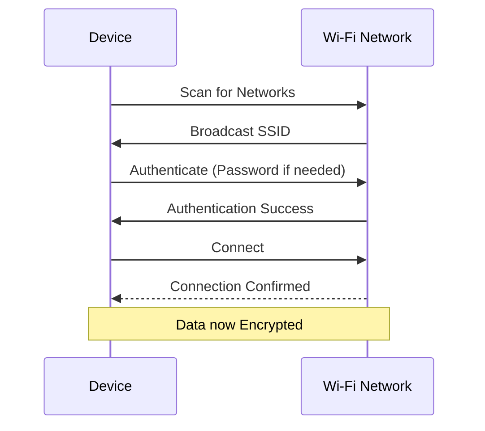

Welcome to your introduction to the world of Wi-Fi and wireless communication! Before our session, please go through the material below. This will help you understand the fundamental concepts we'll be building upon.

## Introduction to Wireless Communication

![[Pasted image 20250930062113.png]]

Wireless communication is a method of transmitting information from one point to another, without using any physical connection like wires or cables. Instead, it relies on electromagnetic waves, such as radio waves, infrared, or even light, to carry signals over part or the entire communication path.

Think about your TV remote, your smartphone connecting to the internet, or even listening to the radio in your car. These are all examples of wireless communication in action. In the context of computer networking, "wireless" most commonly refers to Wi-Fi, which allows devices like laptops, smartphones, and tablets to connect to a network and the internet without being tethered by an Ethernet cable.

**Key Differences from Wired Communication:**

- **Medium:** Wired networks use physical cables (e.g., copper, fiber optic); wireless networks use air (radio waves).
- **Mobility:** Wireless networks offer greater mobility and flexibility, as devices are not tied to a specific location by a cable.
- **Interference:** Wireless signals are more susceptible to interference from other devices, physical obstructions, and even atmospheric conditions.
- **Security:** Transmitting data through the air inherently presents different security challenges compared to data confined within a cable.
- **Reach:** The range of wireless networks can be affected by many factors, whereas wired networks have more predictable distance limitations based on cable type.

## Radio Waves: The Foundation of Wi-Fi

Wi-Fi, at its core, uses radio waves to transmit data. Radio waves are a type of electromagnetic radiation with wavelengths in the electromagnetic spectrum longer than infrared light.

- **Frequency:** This refers to the number of times a radio wave oscillates (repeats its cycle) per second, measured in Hertz (Hz). Wi-Fi typically operates in the 2.4 Gigahertz (GHz) or 5 GHz frequency bands. A Gigahertz is one billion cycles per second.
- **Spectrum:** The radio spectrum is the range of all possible radio frequencies. Different parts of this spectrum are allocated for different purposes (e.g., AM/FM radio, TV broadcasts, mobile phones, Wi-Fi).
- **Channels:** Within the 2.4 GHz and 5 GHz Wi-Fi bands, the spectrum is further divided into smaller segments called channels. When you set up a Wi-Fi network, the access point (router) will use a specific channel. Using different, non-overlapping channels can help reduce interference between nearby Wi-Fi networks.
- **Interference:** Because radio waves travel through the air, they can be disrupted or weakened by various sources. Common sources of Wi-Fi interference include:
    - Other Wi-Fi networks on the same or overlapping channels.
    - Microwave ovens (many operate around 2.45 GHz).
    - Bluetooth devices.
    - Cordless phones.
    - Physical obstructions like thick walls, metal objects, and even water (including people!).

## Wi-Fi Standards (IEEE 802.11)

The Institute of Electrical and Electronics Engineers (IEEE) defines the standards for Wi-Fi technology under the "802.11" family. These standards ensure that Wi-Fi devices from different manufacturers can communicate with each other. Over the years, several standards have been developed, each offering improvements in speed, range, or how they handle interference.

Here's a simplified overview of some common standards:

|Standard|Frequency Band(s)|Max Theoretical Speed (Approx.)|Key Characteristics|
|---|---|---|---|
|**802.11b**|2.4 GHz|11 Mbps|Older standard, prone to interference.|
|**802.11a**|5 GHz|54 Mbps|Less interference than 2.4 GHz but shorter range.|
|**802.11g**|2.4 GHz|54 Mbps|Faster than 802.11b, backward compatible.|
|**802.11n**|2.4 GHz / 5 GHz|600 Mbps|Uses MIMO (Multiple Input, Multiple Output) for better speed/range.|
|**802.11ac**|5 GHz|1.3 Gbps+|"Gigabit Wi-Fi", wider channels, more MIMO streams.|
|**802.11ax**|2.4 GHz / 5 GHz / 6 GHz (Wi-Fi 6E)|9.6 Gbps+|"Wi-Fi 6/6E", better performance in dense environments, OFDMA.|

_Mbps = Megabits per second; Gbps = Gigabits per second._

You don't need to memorize all the details, but it's good to be aware that different standards exist and offer varying performance. Most modern devices support multiple standards for compatibility.

## Basic Wi-Fi Components

Several key hardware components work together to create a Wi-Fi network:

- **Wireless Access Point (WAP or AP):** This is the central device that broadcasts the Wi-Fi signal. In most home setups, the WAP is integrated into the wireless router provided by your Internet Service Provider (ISP) or one you purchase separately. It acts as a bridge between the wireless devices and the wired network (and the internet).
- **Wireless Network Interface Card (WNIC):** This is a component inside your computer, smartphone, or other Wi-Fi-enabled devices. It's essentially a radio transceiver that allows the device to send and receive Wi-Fi signals.
- **Antennas:** Antennas are crucial for sending and receiving radio waves. WAPs and some WNICs have visible external antennas, while many modern devices have internal antennas for a sleeker design. The design and orientation of antennas can affect signal strength and coverage.

## Connecting to a Wi-Fi Network

When you connect your device to a Wi-Fi network, several things happen:

1. **Scanning:** Your device scans the airwaves for available Wi-Fi networks.
2. **SSID (Service Set Identifier):** Each Wi-Fi network is identified by a name, known as the SSID. This is the name you see in the list of available networks (e.g., "MyHomeWiFi," "CoffeeShopFreeWiFi").
    - **Broadcasting:** WAPs typically broadcast their SSID so that devices can easily find and connect to them.
    - **Hidden SSIDs:** It's possible to configure a WAP not to broadcast its SSID. This is a minor security measure (security through obscurity), as the SSID can still be discovered with specialized tools. To connect to a hidden network, you need to know its SSID beforehand and enter it manually.
3. **Authentication:** Before your device can join the network, it usually needs to authenticate. This is like proving you have permission to connect. Common authentication methods include:
    - **Open (No Security):** Anyone can connect. Highly insecure and not recommended.
    - **WEP (Wired Equivalent Privacy):** An old and very insecure encryption protocol. **Avoid using it.**
    - **WPA (Wi-Fi Protected Access):** An interim improvement over WEP.
    - **WPA2 (Wi-Fi Protected Access II):** The most widely used security protocol for Wi-Fi networks for many years. It uses strong encryption.
    - **WPA3 (Wi-Fi Protected Access III):** The latest standard, offering enhanced security features over WPA2, including stronger encryption and protection against certain types of attacks. When you connect to a secure Wi-Fi network, you'll typically be prompted for a password (also known as a pre-shared key or PSK).
4. **Encryption:** Once authenticated, the data transmitted between your device and the WAP is encrypted to protect it from eavesdropping.
    - **TKIP (Temporal Key Integrity Protocol):** Used with WPA. It has known vulnerabilities.
    - **AES (Advanced Encryption Standard):** Used with WPA2 and WPA3. It is a strong and widely trusted encryption algorithm. CCMP (Counter Mode Cipher Block Chaining Message Authentication Code Protocol) is an AES-based encryption protocol used in WPA2.

## Common Wireless Security Concerns

The open nature of wireless communication introduces unique security challenges:

- **Unauthorized Access:** If a Wi-Fi network is not properly secured (e.g., weak password, no password, or outdated security protocols), unauthorized users might connect to it, potentially using your internet bandwidth, accessing shared files, or launching attacks.
- **Eavesdropping (Sniffing):** Attackers can capture wireless data packets out of the air. If the data is unencrypted or weakly encrypted, they might be able to read sensitive information (like passwords or personal data).
- **Denial of Service (DoS):** Attackers can flood the wireless network with traffic or use other techniques to disrupt its normal operation, preventing legitimate users from connecting or using the network.
- **Rogue Access Points:** An attacker might set up a fake WAP that mimics a legitimate one (e.g., "Free_Airport_WiFi") to trick users into connecting. Once connected, the attacker can intercept their traffic.

We will delve deeper into these threats and how to mitigate them in later cybersecurity-focused modules. For now, the key takeaway is that strong authentication and encryption (like WPA2 or WPA3 with a strong password) are essential for Wi-Fi security.

### Try it yourself

- On your Mac, click the Wi-Fi icon in the menu bar at the top of your screen. Observe the list of Wi-Fi networks detected around you. Note their names (SSIDs).
- If you are connected to a Wi-Fi network, press and hold the **Option (⌥)** key on your keyboard, then click the Wi-Fi icon in the menu bar again. You'll see a lot more detailed information about your current connection. Look for:
    - **SSID:** The name of your network.
    - **PHY Mode:** This indicates the 802.11 standard being used (e.g., 802.11ac, 802.11ax).
    - **Security:** This will show the type of security (e.g., WPA2 Personal, WPA3 Personal).
    - **Channel:** The channel your Wi-Fi is currently using.
    - **RSSI (Received Signal Strength Indicator):** A measure of how strong the Wi-Fi signal is. Values closer to 0 (e.g., -40 dBm, -50 dBm) are stronger than values further from 0 (e.g., -80 dBm, -90 dBm).
    - **Noise:** A measure of interfering radio signals. Lower is better (e.g., -95 dBm).
    - **Tx Rate (Transmit Rate):** The current speed at which your Mac is transmitting data to the access point.

### Think about it

- Why do you think Wi-Fi networks operate on specific frequency bands (2.4 GHz, 5 GHz, 6 GHz) rather than just any frequency?
- What are the advantages and disadvantages of using the 2.4 GHz band versus the 5 GHz band for your home Wi-Fi?
- If you were setting up a Wi-Fi network for a small business, what would be your top three security considerations based on what you've learned?

That's it for your pre-class preparation! We'll discuss these concepts further and see them in action during our live session.

<aside> 📌

The slides for the live session can be viewed here: [https://gamma.app/docs/Networking-19-Wi-Fi-Wireless-fesx7mymucigl8u?mode=doc](https://gamma.app/docs/Networking-19-Wi-Fi-Wireless-fesx7mymucigl8u?mode=doc)

Try not to peek before class - spoilers inside!

</aside>