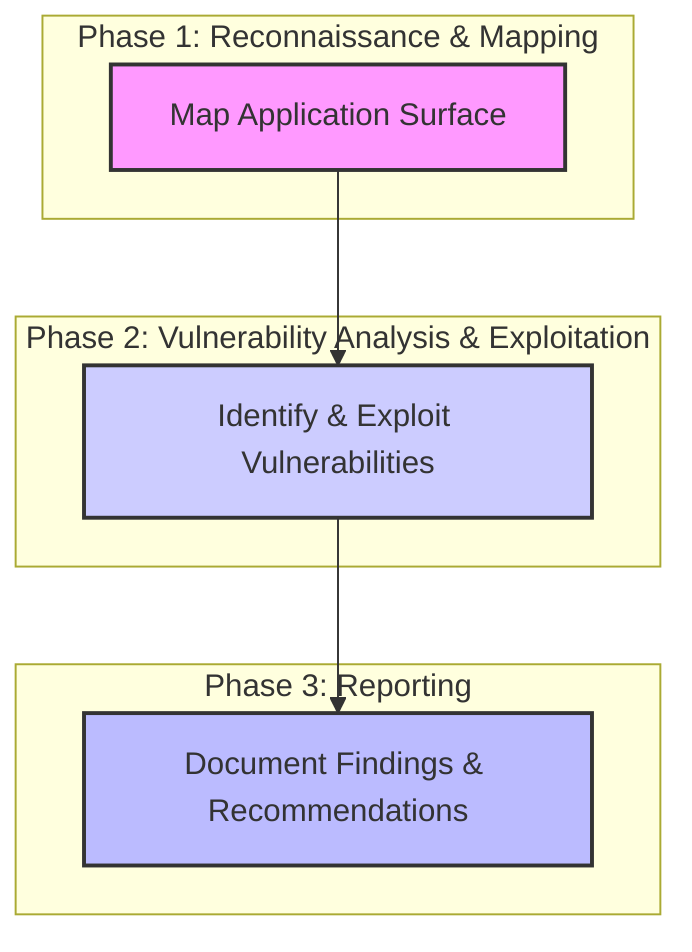

Welcome to the world of web hacking! In the previous week, you learned how attackers perform reconnaissance and enumeration to map out their targets. Now, we shift our focus to one of the most common and critical attack surfaces you discovered during recon: web applications.

These applications are the digital storefronts, login portals, and data gateways for countless organizations. Their public accessibility makes them a prime target for attackers seeking to steal data, disrupt services, or gain an initial foothold into a network. In this module, we'll learn the tools and techniques to test these applications, find their weaknesses, and ultimately, help secure them.

### A Refresher: Core Web Technologies


Before we can break applications, we must understand how they are built. Modern websites are a combination of several core technologies that work together in your browser.

**The HTTP Conversation** The web operates on a client-server model, and the language they use to communicate is the Hypertext Transfer Protocol (HTTP). An HTTP conversation is made up of two parts: the request and the response.

- **The HTTP Request:** When your browser wants something from a server, it sends a request with a few key parts:
    1. **Method:** The action to perform (e.g., `GET` to retrieve data, `POST` to send data).
    2. **Path:** The specific resource you want (e.g., `/users/login`).
    3. **Headers:** Extra information like the `Host`, your `User-Agent` (browser type), and `Cookie` data.
    4. **Body:** Optional data sent with a `POST` request, like your username and password.
- **The HTTP Response:** After the server processes the request, it sends back a response:
    1. **Status Code:** A three-digit code indicating the result (e.g., `200 OK` for success, `404 Not Found` for an error).
    2. **Headers:** Metadata about the response, like `Content-Type` or `Set-Cookie`.
    3. **Body:** The actual content, like the HTML, CSS, and JavaScript for the webpage.

**The Building Blocks of a Web Page**

- **HTML (HyperText Markup Language):** This is the skeleton of a webpage. It defines the structure and content, like headings, paragraphs, images, and forms.
- **CSS (Cascading Style Sheets):** This is the presentation layer. CSS controls the visual appearance: colors, fonts, layout, and spacing, making the raw HTML look polished and professional.
- **JavaScript (JS):** This is the behavior layer. JavaScript brings interactivity to a page, handling things like animations, form validation, and fetching data from the server without a full page reload.

**State and Sessions: Cookies** HTTP is "stateless," meaning each request is independent. To remember you between requests (like keeping you logged in), servers use cookies. When you log in, the server sends a `Set-Cookie` header in the response. Your browser stores this cookie and sends it back with every subsequent request, identifying you to the server.

### The Penetration Tester's Workflow



A regular user is confined by the web page's design. A security tester, however, knows the real interaction is in the HTTP request. This leads to a key insight: The website's front-end (what you see) is just a suggestion. The back-end (the server) is the source of truth. If you can intercept and modify the HTTP request after it leaves your browser but before it reaches the server, you are no longer bound by the front-end's rules. This is the fundamental principle of web hacking.

Finding vulnerabilities isn't a random process; it's a systematic one. A typical web application penetration test follows a structured workflow based on manipulating this HTTP conversation.

**Phase 1: Reconnaissance and Mapping** This phase is about understanding the target. You've already practiced reconnaissance, but in a web context, it becomes more specific. The goal is to build a complete map of the application's structure and technology.

- **Automated Discovery:** You start by using tools to find hidden directories and files that are not linked from the main site. These can be forgotten admin panels, backup files, or configuration pages that provide valuable information.
- **Manual Exploration & Proxying:** You then systematically browse the entire application as a normal user. By using an intercepting proxy, you can log every request your browser makes. This creates a comprehensive site map of every function, page, and API endpoint you have accessed. You pay close attention to areas with complex functionality: user registration, login forms, profile settings, file uploads, and search fields.
- **Technology Identification:** You analyze HTTP headers and page source code to identify the technologies used (e.g., what web server software, what programming language, what frameworks). This helps you focus your testing on vulnerabilities common to that specific tech stack.

**Phase 2: Vulnerability Analysis and Testing** With a map of the application, you can begin actively probing for weaknesses. This is a cycle of forming a hypothesis and testing it.

- **Forming a Hypothesis:** Based on a specific feature, you will form a hypothesis. For example: "This search bar takes my input and puts it on the page. I hypothesize it might be vulnerable to Cross-Site Scripting (XSS)." Or: "This page is accessed with `?id=123`. I hypothesize it might be vulnerable to SQL Injection." We will learn more about common web vulnerabilities in the upcoming sessions.
- **Testing the Hypothesis:** You then use specialized tools to test this hypothesis. This involves capturing a legitimate request, modifying it in various ways, and re-sending it to the server. You carefully analyze each response for signs that the server behaved in an unexpected way, which could indicate a vulnerability. This can be a manual process of tweaking and resending, or an automated one where a tool sends thousands of variations.
- **Exploitation:** Once a vulnerability is confirmed, you might perform a simple action to demonstrate its impact, such as retrieving a piece of data you should not have access to.

**Phase 3: Reporting** The final, and arguably most important, phase is documenting your findings. A penetration test is useless if the development team cannot understand the issues. You write a clear, concise report detailing each vulnerability, its potential impact on the business, and step-by-step instructions on how to reproduce it, along with recommendations for fixing it.

### The Intercepting Proxy: Your Core Hacking Tool


The central tool in the web security tester's workflow is the intercepting proxy. The industry-standard tool for this is Burp Suite. It is a powerful platform of integrated tools designed for web application security testing.

It runs on your computer and acts as a "person-in-the-middle" for your web traffic. All your browser's requests go to the proxy first, and all server responses come back to the proxy before reaching your browser. This gives you the power to Intercept, View, and Modify all HTTP and HTTPS traffic in transit.

Burp Suite contains several key tools, each in its own tab:

- **Proxy:** This is the heart of Burp Suite. Its "Intercept" feature allows you to pause requests and responses in real-time, modify them on the fly, and then forward them to their destination. The "HTTP history" sub-tab logs every request your browser makes, which is invaluable for reviewing what you have tested.
- **Target:** This tool builds a detailed site map of the target application. As you browse the website with the proxy enabled, the Target tab automatically populates with all the pages, directories, and API endpoints you discover.
- **Repeater:** This is your primary tool for manual, iterative testing. You can send any request from your history to Repeater, modify any part of it (the path, headers, or body), and send it again and again. This allows you to carefully probe for vulnerabilities by analyzing how different inputs affect the server's response.
- **Intruder:** This is a powerful tool for automating customized attacks. You can take a request, mark one or more positions for your payloads, and configure Intruder to send thousands of requests, substituting your payloads at the marked positions. This is useful for fuzzing for vulnerabilities, brute-forcing passwords, or enumerating identifiers.

**How Does It Work with HTTPS?** You might wonder how this is possible with encrypted HTTPS traffic. The proxy effectively breaks the single client-to-server connection into two separate connections:

1. An encrypted connection between your browser and the proxy.
2. An encrypted connection between the proxy and the end server.

The proxy decrypts the traffic from your browser, allows you to view and modify it, and then re-encrypts it before sending it to the server. For your browser to trust the proxy to do this, you must install Burp's CA Certificate. This certificate tells your browser to trust the proxy as a valid certificate authority for your testing purposes, preventing security warnings.

### Setup

In the next section, we will dive deep into using Burp Suite. For now, complete the following steps to get it installed and configured.

**1. Install Burp Suite Community Edition**

- Go to [https://portswigger.net/burp/communitydownload](https://portswigger.net/burp/communitydownload)
- Download and run the installer for your operating system, using the default settings (macOS Apple Silicon if for Macbook or Linux(ARM) if for Kali): [https://portswigger.net/burp/releases/community/latest](https://portswigger.net/burp/releases/community/latest)

**Macbook version:**


**Kali version:**


When installing Burp Suite Community **on Kali** download **Linux(ARM) version**. Then go to Downloads folder (or folder when you downloaded installer script) and run in terminal:

```bash
# make intallation script executable
chmod +x burpsuite_community_linux_arm64_v2025_8_4.sh 

# and then run installation script:
./burpsuite_community_linux_arm64_v2025_8_4.sh
```

**2. Configure Your Browser and Install Burp's CA Certificate**

- Go to [](https://portswigger.net/burp/documentation/desktop/external-browser-config/certificate)[https://portswigger.net/burp/documentation/desktop/external-browser-config](https://portswigger.net/burp/documentation/desktop/external-browser-config)
- Follow the detailed instructions for your specific browser to configure and install the CA certificate. This is a critical step for intercepting HTTPS traffic.

Screens from Kali Linux and Firefox:


- Next step is to configure proxy settings. The best way is to install Chrome or Firefox Extensions → **Foxy Proxy**:

[https://addons.mozilla.org/pl/firefox/addon/foxyproxy-standard/](https://addons.mozilla.org/pl/firefox/addon/foxyproxy-standard/)

[https://chromewebstore.google.com/detail/foxyproxy/gcknhkkoolaabfmlnjonogaaifnjlfnp?hl=en-GB&utm_source=ext_sidebar](https://chromewebstore.google.com/detail/foxyproxy/gcknhkkoolaabfmlnjonogaaifnjlfnp?hl=en-GB&utm_source=ext_sidebar)

```

```

**YT Tutorial how to set up browser’s CA certificate and Foxy Proxy on Kali:**

[https://www.youtube.com/watch?v=MyJnuw7afX8](https://www.youtube.com/watch?v=MyJnuw7afX8)

<aside> 📌

The slides for the live session can be viewed here: [https://gamma.app/docs/Module-2-Week-2-Session-1-Web-Hacking-Intro-Attackers-Toolkit-4v9o6csfye7od53?mode=doc](https://gamma.app/docs/Module-2-Week-2-Session-1-Web-Hacking-Intro-Attackers-Toolkit-4v9o6csfye7od53?mode=doc)

Try not to peek before class - spoilers inside!

</aside>