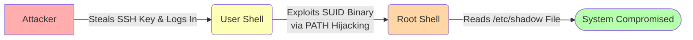

Our upcoming lesson will be about the concept of "boot2root, where we'll take a system from zero access to full administrative control. There are countless ways to compromise a system, and recognizing which path to take is a skill that only comes with practice.

This prep will introduce the general methodology an attacker follows and then cover the specific concepts you'll need to know for the upcoming session.

### The General Path to Compromise

Attackers, and ethical hackers, typically follow a high-level, three-step process:

1. **Gaining Initial Access (The Foothold):** The first step is to get onto the system, even with minimal privileges. This could be done by exploiting a web vulnerability, finding leaked credentials, or tricking a user.
2. **Privilege Escalation:** Once on the machine, the goal is to elevate access from a restricted user account to a privileged one, most commonly the **root** user on Linux, who has complete control.
3. **Achieving the Objective:** With root access, the attacker can now accomplish their goal, such as stealing sensitive data, installing persistent backdoors, or using the machine to attack other systems.

We will use a specific chain of misconfigurations to go from foothold to root. Misconfigurations are much more common than 0-day vulnerabilities in actual environments and could be as dangerous

Here are the core concepts you'll need to understand.

### 1. The Foothold: SSH Key-Based Authentication

While passwords are common, many systems rely on a more secure method: SSH key-based authentication. This uses a pair of cryptographic keys:

- **Public Key (`id_rsa.pub`):** The "lock." This key is placed on any server you want to access and is safe to share.
- **Private Key (`id_rsa`):** The "key." It is stored securely on your computer and must **never** be shared.

When you connect, the server uses your public key to issue a challenge that only your private key can solve. For an attacker, **stealing a user's private key is like stealing their master password.** It grants them immediate access to any server that trusts that user's key. This will be our initial entry point.

### 2. The Escalation: Abusing SUID and the PATH

Once on the system as a regular user, our goal is to become root. We will do this by exploiting two concepts working together:

- **SUID (Set User ID) Permission:** Linux has a special permission called SUID. When set on an executable file, the file doesn't run with the permissions of the user who launched it; it runs with the permissions of the **file's owner**. If a program is owned by `root` and has the SUID permission set, it runs with root privileges, even when a normal user launches it. A popular resource for attackers is [https://gtfobins.github.io/](https://gtfobins.github.io/), a curated list of Unix binaries that can be abused to get a root shell if they are misconfigured with SUID permissions.
- **The PATH Environment Variable:** When you type a command like `ls`, the system finds it by searching a list of directories defined in the `PATH` variable. The shell searches these directories in order and runs the first match it finds.

This leads to an exploit called **PATH Hijacking**. If a privileged SUID program tries to run another command without using its full path, an attacker can create a malicious script with the same name, place it in a directory they control, and manipulate the PATH variable to force the privileged program to run their malicious script with root permissions.

### 3. The Objective: The `/etc/shadow` File

Now that we are root, we can read the system's most sensitive file: `/etc/shadow`. This file stores the **hashed passwords** for all users and is only readable by the root user.

Each line in `/etc/shadow` represents one user. For example:`jdoe:$6$saltsalt$longhashedpassword...:18301:0:99999:7:::`

Let's break down the two most important parts:

- `jdoe`: The username.
- `$6$saltsalt$longhashedpassword...`: The user's hashed password. The `$6$` indicates it's a strong SHA-512 hash.

While the passwords are not in plaintext, an attacker who has this file can use powerful offline tools like _John the Ripper_ or _Hashcat_ to crack them. Gaining access to this file is a major step towards full and persistent control of a network.

<aside> 📌

The slides for the live session can be viewed here: [https://gamma.app/docs/Module-2-Week-5-Session-3-Exploiting-Misconfigurations-Boot-to--1xermzntk1rqjcz?mode=doc](https://gamma.app/docs/Module-2-Week-5-Session-3-Exploiting-Misconfigurations-Boot-to--1xermzntk1rqjcz?mode=doc)

Try not to peek before class - spoilers inside!

</aside>